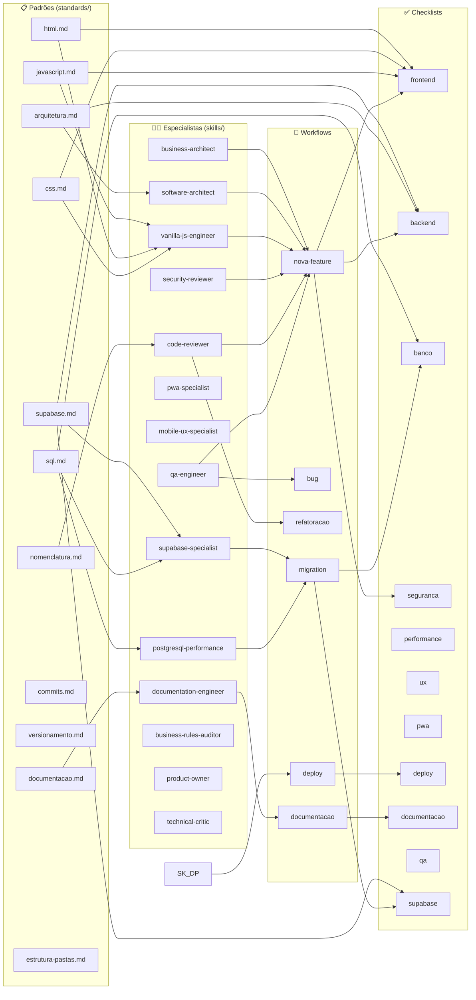
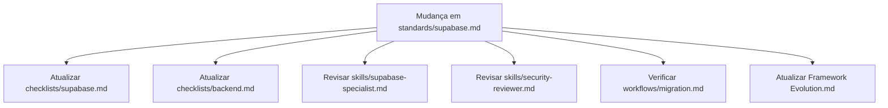

# Mapa de Dependências do Framework

> Diagrama mostrando como padrões, especialistas, workflows e checklists se relacionam.

---

## Diagrama Principal

---

## Dependências por Padrão

| Padrão | Especialistas que o usam | Checklists que o referenciam |
|---|---|---|
| `arquitetura.md` | Software Architect, Code Reviewer | backend, supabase |
| `html.md` | Vanilla JS Engineer, Mobile UX | frontend, ux |
| `css.md` | Vanilla JS Engineer, Mobile UX | frontend, ux, pwa |
| `javascript.md` | Vanilla JS Engineer, Code Reviewer | frontend, backend |
| `supabase.md` | Supabase Specialist, Security Reviewer | supabase, backend, seguranca |
| `sql.md` | Supabase Specialist, PostgreSQL Performance | banco, supabase |
| `documentacao.md` | Documentation Engineer | documentacao |
| `nomenclatura.md` | Code Reviewer, todos os engineers | frontend, backend |
| `commits.md` | Todos | — |

---

## Dependências por Workflow

| Workflow | Padrões Consultados | Skills Ativadas | Checklists Usados |
|---|---|---|---|
| `nova-feature` | Todos | Todos (conforme área) | frontend, backend, supabase, seguranca |
| `bug` | Relevantes ao bug | QA, Developer, Security | backend, seguranca |
| `refatoracao` | arquitetura, javascript | Code Reviewer, Software Architect | frontend, backend |
| `migration` | sql, supabase | Supabase Specialist, PG Performance | banco, supabase |
| `deploy` | — | — | deploy |
| `documentacao` | documentacao | Documentation Engineer | documentacao |

---

## Impacto de Mudanças no Framework

Ao mudar qualquer padrão, verifique o impacto em: checklists, skills e workflows que o referenciam.
