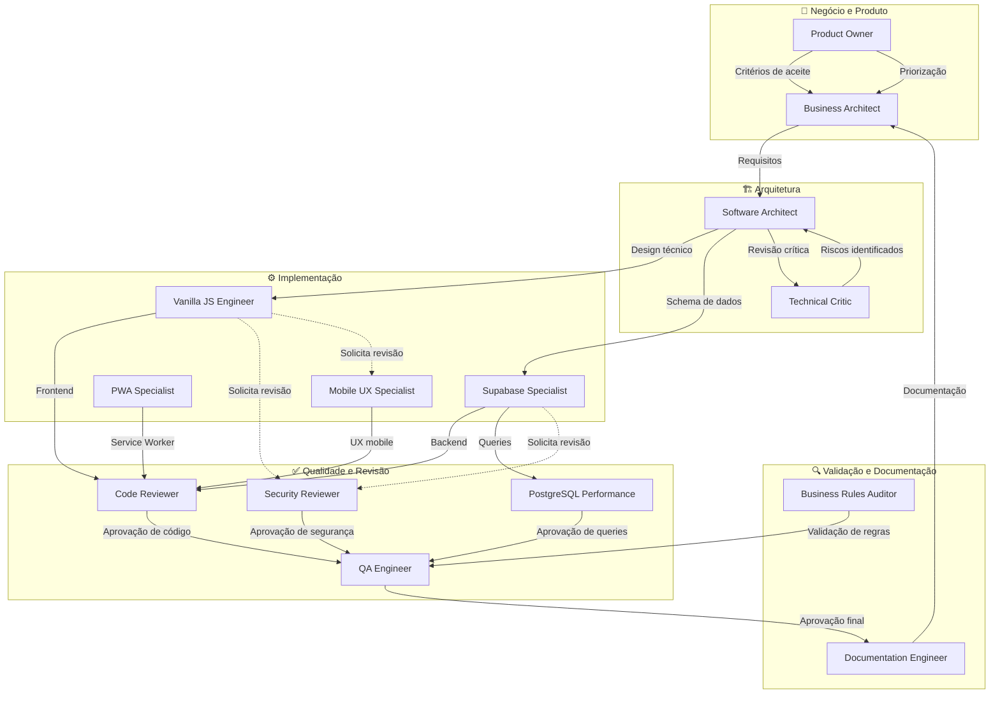

# Mapa de Especialistas

> Diagrama de relacionamentos entre os 14 especialistas do framework.

---

## Diagrama Mermaid

---

## Responsabilidades por Especialista

| Especialista | Foco Principal | Não Faz |
|---|---|---|
| **Business Architect** | Requisitos → Specs técnicas | Código |
| **Product Owner** | Priorização, aceite | Implementação técnica |
| **Software Architect** | Design de sistema, ADRs | Lógica de negócio |
| **Technical Critic** | Riscos, questionar premissas | Implementar ou aprovar |
| **Vanilla JS Engineer** | Frontend puro JS | Backend |
| **Supabase Specialist** | Supabase, RLS, Edge Functions | Lógica de negócio |
| **PWA Specialist** | Service Worker, offline, manifesto | UI design |
| **Mobile UX Specialist** | Touch, responsivo, mobile | Lógica JavaScript |
| **Code Reviewer** | Qualidade, padrões, legibilidade | Novas features |
| **Security Reviewer** | OWASP, auth, RLS audit | Implementar features |
| **PostgreSQL Performance** | Queries, índices, EXPLAIN | Código da aplicação |
| **QA Engineer** | Testes, regressão, UAT | Corrigir bugs |
| **Business Rules Auditor** | Implementação vs. regras | Redesenhar |
| **Documentation Engineer** | Docs técnicas, JSDoc, runbooks | Decisões arquiteturais |

---

## Quando Ativar Cada Especialista

### Fluxo Nova Feature (ordem recomendada)
1. Business Architect → Product Owner (validar problema)
2. Software Architect → Technical Critic (design e revisão crítica)
3. Supabase Specialist (banco e RLS)
4. Vanilla JS Engineer + Mobile UX + PWA (implementação)
5. Code Reviewer + Security Reviewer (revisão)
6. Business Rules Auditor (validação de regras)
7. PostgreSQL Performance (otimização de queries)
8. QA Engineer (testes)
9. Documentation Engineer (docs)

### Para Revisão de PR
- Code Reviewer (sempre)
- Security Reviewer (sempre)
- PostgreSQL Performance (se tem queries)
- Business Rules Auditor (se tem lógica de negócio)

### Para Diagnóstico de Bug
- QA Engineer (reprodução)
- PostgreSQL Performance (se bug de performance)
- Security Reviewer (se bug de segurança)
- Code Reviewer (revisão do fix)
