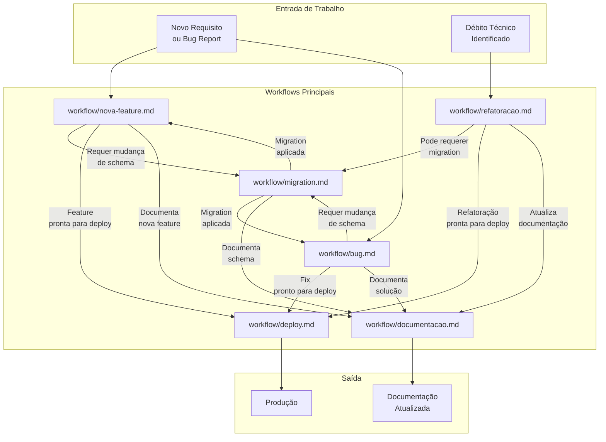
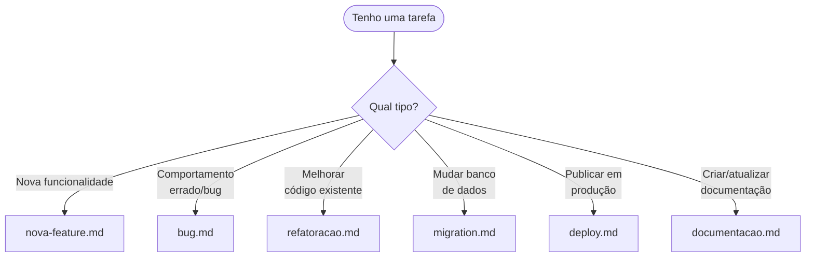

# Mapa de Workflows

> Diagrama dos 6 workflows conectados entre si.

---

## Diagrama Mermaid



---

## Fluxo Detalhado por Cenário

### Cenário 1: Nova Feature Simples (sem DB)
```
Requisito → nova-feature.md → deploy.md → documentacao.md
```

### Cenário 2: Nova Feature com Banco de Dados
```
Requisito → nova-feature.md → migration.md → nova-feature.md → deploy.md → documentacao.md
```

### Cenário 3: Bug Crítico (Hotfix)
```
Bug Report → bug.md (urgente) → deploy.md (hotfix) → bug.md (pós-mortem)
```

### Cenário 4: Refatoração com Migration
```
Débito Técnico → refatoracao.md → migration.md (se necessário) → deploy.md → documentacao.md
```

---

## Decisão de Qual Workflow Usar



---

## Dependências Entre Workflows

| Workflow | Depende de | Alimenta |
|---|---|---|
| `nova-feature.md` | `migration.md` (se DB) | `deploy.md`, `documentacao.md` |
| `bug.md` | `migration.md` (se DB) | `deploy.md`, `documentacao.md` |
| `refatoracao.md` | `migration.md` (se DB) | `deploy.md`, `documentacao.md` |
| `migration.md` | — | `nova-feature.md`, `bug.md` |
| `deploy.md` | Todos os outros | — |
| `documentacao.md` | Todos os outros | — |
